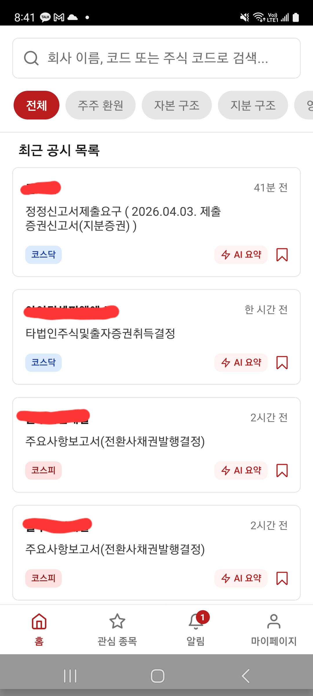
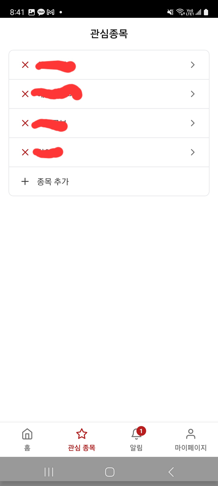
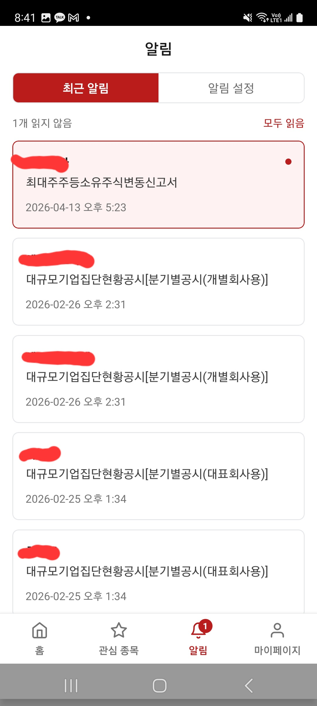
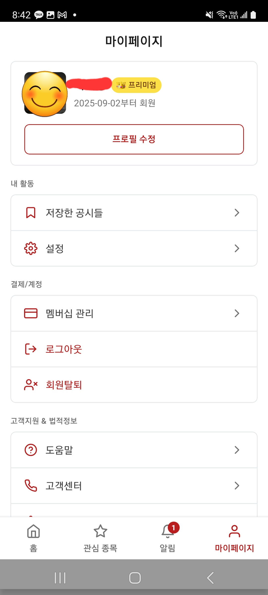

# 주바비 (Jubabi)

> 한국 주식 공시 실시간 알림 앱 — DART 공시를 쉽고 빠르게

<div align="center">






</div>

---

## 개요

주바비는 한국 금융감독원 전자공시시스템(DART)의 공시를 실시간으로 모니터링하고, 관심 종목 및 키워드 기반 알림을 제공하는 Android 앱입니다. AI 요약 기능을 통해 복잡한 공시를 누구나 쉽게 이해할 수 있습니다.

## 주요 기능

- **실시간 공시 알림** — DART RSS 폴링으로 새 공시 발생 시 즉시 푸시 알림
- **관심 종목 등록** — 특정 기업의 공시만 골라 알림 수신
- **키워드 알림** — "유상증자", "자사주" 등 원하는 키워드 등록
- **AI 공시 요약** — Claude Sonnet으로 복잡한 공시를 쉬운 말로 요약 (프리미엄)
- **카테고리 필터** — 자본구조 변화, 주주환원, 지분구조 등 분류별 탐색
- **북마크** — 중요 공시 저장 및 관리
- **카카오 로그인** — 간편 소셜 로그인
- **멤버십** — 무료 / 프리미엄 / 평생회원 Google Play 인앱결제

## 기술 스택

### Frontend

| 기술                          | 용도                    |
| ----------------------------- | ----------------------- |
| React Native + Expo (SDK 53)  | 크로스플랫폼 앱         |
| Expo Router                   | 파일 기반 내비게이션    |
| NativeWind (Tailwind CSS)     | 스타일링                |
| Expo Notifications            | 푸시 알림 수신          |
| Expo SecureStore              | JWT 토큰 보관           |
| react-native-iap              | Google Play 인앱결제    |
| react-native-markdown-display | AI 요약 마크다운 렌더링 |

### Backend

| 기술                            | 용도                 |
| ------------------------------- | -------------------- |
| Node.js + Express 5             | REST API 서버        |
| TypeScript                      | 타입 안전성          |
| Drizzle ORM + Neon (PostgreSQL) | 데이터베이스         |
| Anthropic Claude Sonnet 4.6     | AI 공시 요약         |
| Expo Server SDK                 | 푸시 알림 발송       |
| node-cron                       | DART RSS 주기적 폴링 |
| PM2                             | 프로세스 관리        |
| JWT                             | 인증                 |

## 아키텍처

```
┌─────────────────────────────────────────────────────────────┐
│                    Android App (Expo)                        │
│  홈(공시 목록) · 검색 · 관심종목 · 알림 · 프로필           │
└──────────────────────┬──────────────────────────────────────┘
                       │ HTTPS / JWT
┌──────────────────────▼──────────────────────────────────────┐
│                  Express REST API                            │
│  /auth  /api/disclosures  /api/alerts  /api/favorites       │
│  /api/notifications  /api/bookmarks                         │
└──────┬─────────────────────────────────┬────────────────────┘
       │                                 │
┌──────▼──────────┐           ┌──────────▼──────────┐
│  Neon Postgres  │           │  외부 API            │
│  (Drizzle ORM)  │           │  DART OpenAPI        │
└─────────────────┘           │  Kakao OAuth         │
                              │  Claude Sonnet API   │
                              │  Expo Push Service   │
                              └─────────────────────┘
```

## 프로젝트 구조

```
jubabi/
├── frontend/                  # Expo React Native 앱
│   ├── app/
│   │   └── (tabs)/
│   │       ├── index.tsx      # 홈 — 최근 공시 목록
│   │       ├── search/        # 기업 검색
│   │       ├── favorite/      # 관심 종목
│   │       ├── alert/         # 알림 목록 & 알림 설정
│   │       └── profile/       # 프로필, 멤버십 관리
│   ├── components/
│   │   └── lists/
│   │       └── DisclosureList.tsx  # 공시 카드 + AI 요약 모달
│   ├── context/
│   │   └── NotificationContext.tsx
│   └── lib/
│       ├── apiFetch.ts        # 인증 포함 중앙 fetch 래퍼
│       └── myApi.ts
│
└── backend/                   # Express API 서버
    └── src/
        ├── routes/            # auth, disclosures, alerts, favorites …
        ├── services/
        │   ├── disclosures.service.ts  # DART RSS 폴링
        │   └── summarize.ts            # Claude AI 요약 + DB 캐시
        ├── utils/
        │   └── parseDisclosure.ts      # DART 문서 파싱
        └── db/
            └── schema.ts      # Drizzle 스키마
```

## 실행 방법

### 사전 요구사항

- Node.js 20+
- Expo CLI (`npm install -g expo-cli`)
- Android 기기 또는 에뮬레이터

### Backend

```bash
cd backend
cp .env.example .env   # 환경변수 설정
npm install
npm run dev
```

필요한 환경변수:

```
DATABASE_URL=
JWT_SECRET=
DART_API_KEY=
KAKAO_REST_API_KEY=
KAKAO_CLIENT_SECRET=
KAKAO_ADMIN_KEY=
ANTHROPIC_API_KEY=
BACKEND_BASE_URL=
```

### Frontend

```bash
cd frontend
npm install
npm run dev            # APP_VARIANT=development
```

## 멤버십 구조

| 기능             | 무료 | 프리미엄 | 평생회원 |
| ---------------- | :--: | :------: | :------: |
| 관심 종목        | 5개  |   30개   |  무제한  |
| 키워드 알림      | 2개  |   10개   |  무제한  |
| 실시간 공시 알림 |  ✓   |    ✓     |    ✓     |
| 카테고리 필터    |  ✓   |    ✓     |    ✓     |
| AI 공시 요약     |  —   |    ✓     |    ✓     |
| 우선 고객 지원   |  —   |    —     |    ✓     |
