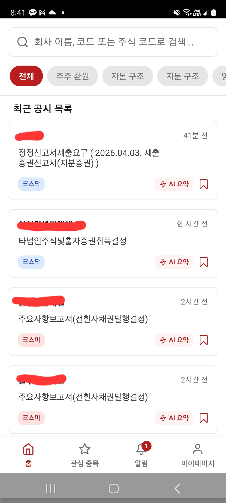
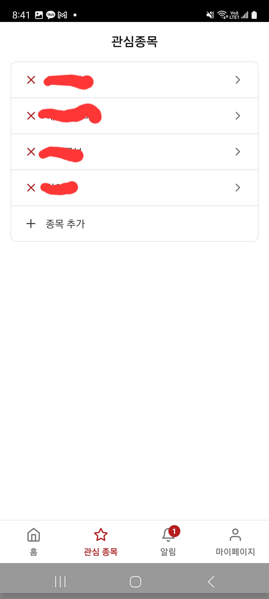
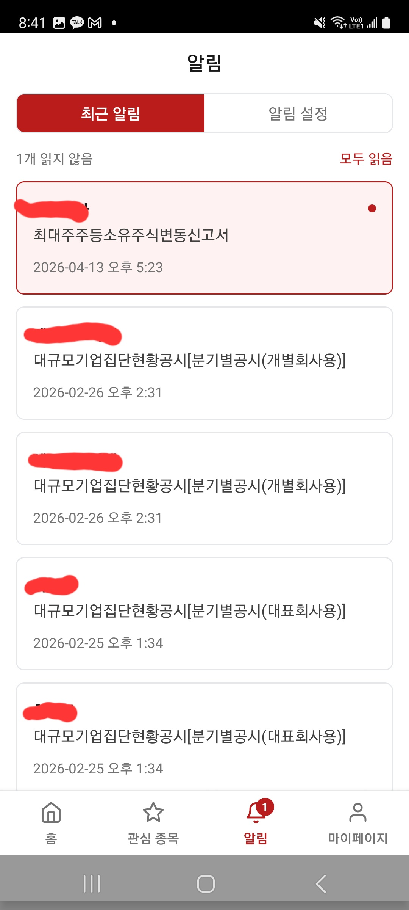
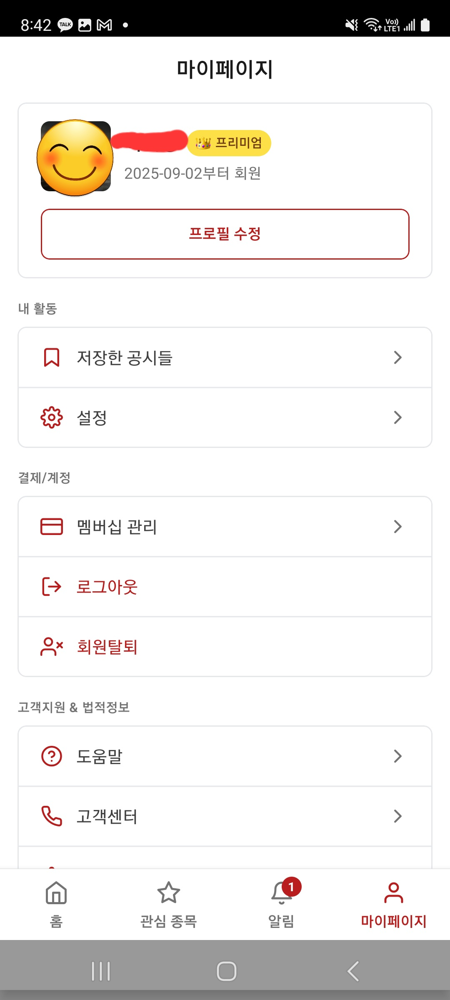

# 주밥 (Jubabi)

> 한국 주식 공시 알림 앱. DART에 새 공시가 올라오면 관심종목·키워드에 맞는 사용자에게 푸시를 보냅니다.

<div align="center">






</div>

## 주요 기능

- **공시 알림**: DART RSS를 5초마다 확인해서 새 공시를 푸시로 보냅니다
- **관심종목 / 키워드 알림**: 등록한 회사나 키워드("유상증자" 등)에 해당하는 공시만 받습니다
- **AI 공시 요약**: 공시 원문을 Claude로 요약합니다 (프리미엄)
- **카테고리 필터, 북마크, 카카오 로그인**

운영 데이터 (2026-09 기준): 기업 116,445곳, 수집 공시 45,150건 (2025-09-02부터)

## 기술 스택

- **Backend**: Node.js, Express 5, TypeScript, Drizzle ORM, PostgreSQL (Neon)
- **Frontend**: React Native (Expo), Expo Router, NativeWind
- **Infra**: AWS EC2, systemd, SSM Parameter Store
- **외부 API**: DART, Kakao OAuth, Claude API, Expo Push

## 구조

```
Android 앱 (Expo)
     │  HTTP + JWT
     ▼
EC2 (Node.js 프로세스 1개, systemd)
 ├─ Express API
 ├─ RSS 폴러 (5초)          DART RSS → 새 공시 저장 → 수신자 찾기 → 푸시
 └─ node-cron (평일 07:00)  DART 기업 목록 동기화
     │
     ├─ Neon PostgreSQL
     ├─ SSM Parameter Store (시크릿)
     └─ DART / Kakao / Claude / Expo Push
```

## 설계하면서 고민한 것

**폴링 주기를 5초로 한 이유**
DART RSS는 최근 공시 50건만 보여줍니다. 제가 확인했을 때 50건이 다 바뀌는 데 약 40분이 걸렸습니다. 그 안에 한 번만 읽으면 놓치는 공시는 없습니다. 5초면 공시가 많이 몰리는 시간에도 여유가 충분하고, 알림 지연도 최대 5초 정도입니다.

**같은 알림이 두 번 가지 않게**
처음에는 처리한 공시를 메모리에만 기록했습니다. 그래서 서버가 재시작되거나 폴링이 겹치면 같은 알림이 다시 나갔습니다. 운영 DB에서 알림 84건 중 11건이 중복이었습니다. 지금은 공시를 `INSERT ... ON CONFLICT DO NOTHING RETURNING`으로 저장하고, 처음 저장했을 때만 푸시를 보냅니다. 메모리 기록은 DB 조회를 줄이는 용도로만 씁니다.

**기업 목록 동기화**
116,445건을 매일 받지만 실제로 바뀌는 건 몇 건 안 됩니다. `ON CONFLICT DO UPDATE ... WHERE IS DISTINCT FROM`으로 값이 바뀐 행만 업데이트합니다.

**Lambda 대신 EC2**
5초마다 폴링하려면 Lambda에서도 결국 계속 떠 있어야 해서 비용 차이가 거의 없었습니다. 서버가 계속 떠 있으면 기업 목록(11만 건)과 처리한 공시 기록을 메모리에 두고 쓸 수 있다는 장점도 있습니다.

**시크릿은 Parameter Store에**
운영 서버에는 `.env` 파일을 두지 않습니다. 앱이 시작할 때 SSM에서 값을 읽고, EC2는 액세스 키 대신 IAM 역할로 접근합니다. 필수 값이 없으면 바로 종료합니다.

## 실행

```bash
cd backend
cp .env.example .env   # 값 채우기
npm install
npm run dev            # NODE_ENV=development면 SSM 대신 .env 사용
npm test               # PGlite(메모리 Postgres)로 테스트
```

```bash
cd frontend
npm install
npm run dev
```

## 배포

```bash
git pull && npm ci && npm run build
sudo systemctl restart jubabi
```

`/etc/systemd/system/jubabi.service`

```ini
[Service]
User=ec2-user
WorkingDirectory=/home/ec2-user/jubabi/backend
ExecStart=/usr/bin/node dist/server.js
Restart=always
RestartSec=5
Environment=NODE_ENV=production
Environment=PORT=5001
Environment=TZ=Asia/Seoul
```

## 아직 부족한 점

- HTTP 평문 통신입니다. 도메인을 연결한 뒤 HTTPS를 적용할 예정입니다.
- 인앱결제를 서버에서 검증하지 않습니다 (Google Play API 연동 필요).
- 마이그레이션 파일만으로는 빈 DB에 스키마를 만들 수 없습니다. 첫 마이그레이션 전에 테이블 일부를 직접 만들었기 때문입니다. 테스트는 `schema.ts`에서 바로 테이블을 만듭니다.
- 서버가 1대라는 전제로 만들었습니다. 여러 대로 늘리면 기업 목록 동기화 크론이 서버마다 실행됩니다.
